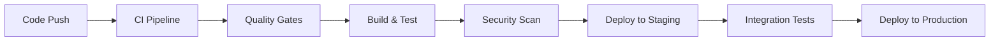

# CI/CD Implementation Guide for HireMe Application

## Table of Contents
1. [CI/CD Overview](#cicd-overview)
2. [GitHub Actions Workflows](#github-actions-workflows)
3. [Testing Pipeline](#testing-pipeline)
4. [Deployment Pipeline](#deployment-pipeline)
5. [Environment Management](#environment-management)
6. [Security & Quality Gates](#security--quality-gates)
7. [Monitoring & Notifications](#monitoring--notifications)

---

## CI/CD Overview

### **Continuous Integration (CI)**
- **Code Quality Checks**: PHPStan, ESLint, Prettier
- **Automated Testing**: PHPUnit (Backend), Jest (Frontend)
- **Security Scanning**: Dependency vulnerability checks
- **Build Verification**: Ensure application builds successfully

### **Continuous Deployment (CD)**
- **Staging Environment**: Automatic deployment on feature branches
- **Production Environment**: Manual approval for main branch
- **Database Migrations**: Automated with rollback capabilities
- **Zero-Downtime Deployments**: Blue-green deployment strategy

### **Pipeline Architecture**


---

## GitHub Actions Workflows

### **1. Main CI/CD Pipeline**

Create `.github/workflows/ci-cd.yml`:

```yaml
name: CI/CD Pipeline

on:
  push:
    branches: [ main, develop ]
  pull_request:
    branches: [ main, develop ]

env:
  PHP_VERSION: '8.1'
  NODE_VERSION: '18'

jobs:
  # ========================================
  # CONTINUOUS INTEGRATION JOBS
  # ========================================
  
  backend-tests:
    name: Backend Tests & Quality
    runs-on: ubuntu-latest
    
    services:
      mysql:
        image: mysql:8.0
        env:
          MYSQL_DATABASE: hireme_testing
          MYSQL_USER: hireme_user
          MYSQL_PASSWORD: secret
          MYSQL_ROOT_PASSWORD: secret
        ports:
          - 3306:3306
        options: --health-cmd="mysqladmin ping" --health-interval=10s --health-timeout=5s --health-retries=3
      
      redis:
        image: redis:7.0
        ports:
          - 6379:6379
        options: --health-cmd="redis-cli ping" --health-interval=10s --health-timeout=5s --health-retries=3

    steps:
      - name: Checkout code
        uses: actions/checkout@v4

      - name: Setup PHP
        uses: shivammathur/setup-php@v2
        with:
          php-version: ${{ env.PHP_VERSION }}
          extensions: dom, curl, libxml, mbstring, zip, pcntl, pdo, sqlite, pdo_sqlite, bcmath, soap, intl, gd, exif, iconv
          coverage: xdebug

      - name: Cache Composer dependencies
        uses: actions/cache@v3
        with:
          path: /tmp/composer-cache
          key: ${{ runner.os }}-composer-${{ hashFiles('**/composer.lock') }}
          restore-keys: |
            ${{ runner.os }}-composer-

      - name: Install Composer dependencies
        run: |
          composer install --no-progress --prefer-dist --optimize-autoloader --no-interaction

      - name: Create environment file
        run: |
          cp .env.testing .env
          php artisan key:generate

      - name: Run database migrations
        run: php artisan migrate --force
        env:
          DB_CONNECTION: mysql
          DB_HOST: 127.0.0.1
          DB_PORT: 3306
          DB_DATABASE: hireme_testing
          DB_USERNAME: hireme_user
          DB_PASSWORD: secret

      - name: Run PHPUnit tests with coverage
        run: vendor/bin/phpunit --coverage-clover coverage.xml
        env:
          DB_CONNECTION: mysql
          DB_HOST: 127.0.0.1
          DB_PORT: 3306
          DB_DATABASE: hireme_testing
          DB_USERNAME: hireme_user
          DB_PASSWORD: secret
          REDIS_HOST: 127.0.0.1

      - name: Run PHPStan static analysis
        run: vendor/bin/phpstan analyse --memory-limit=2G

      - name: Run Laravel Pint code style check
        run: vendor/bin/pint --test

      - name: Upload coverage to Codecov
        uses: codecov/codecov-action@v3
        with:
          token: ${{ secrets.CODECOV_TOKEN }}
          file: ./coverage.xml
          flags: backend

  frontend-tests:
    name: Frontend Tests & Quality
    runs-on: ubuntu-latest

    steps:
      - name: Checkout code
        uses: actions/checkout@v4

      - name: Setup Node.js
        uses: actions/setup-node@v4
        with:
          node-version: ${{ env.NODE_VERSION }}
          cache: 'npm'

      - name: Install dependencies
        run: npm ci

      - name: Run ESLint
        run: npm run lint

      - name: Run Prettier check
        run: npm run format:check

      - name: Run Jest tests with coverage
        run: npm run test:coverage

      - name: Build production bundle
        run: npm run build

      - name: Upload coverage to Codecov
        uses: codecov/codecov-action@v3
        with:
          token: ${{ secrets.CODECOV_TOKEN }}
          directory: ./coverage
          flags: frontend

  security-scan:
    name: Security Vulnerability Scan
    runs-on: ubuntu-latest

    steps:
      - name: Checkout code
        uses: actions/checkout@v4

      - name: Setup PHP
        uses: shivammathur/setup-php@v2
        with:
          php-version: ${{ env.PHP_VERSION }}

      - name: Install Composer dependencies
        run: composer install --no-dev --optimize-autoloader

      - name: Run security audit for PHP dependencies
        run: |
          composer audit --format=json > php-audit.json || true
          if [ -s php-audit.json ]; then
            echo "PHP security vulnerabilities found"
            cat php-audit.json
            exit 1
          fi

      - name: Setup Node.js
        uses: actions/setup-node@v4
        with:
          node-version: ${{ env.NODE_VERSION }}

      - name: Install npm dependencies
        run: npm ci

      - name: Run npm security audit
        run: |
          npm audit --audit-level=high --json > npm-audit.json || true
          if [ -s npm-audit.json ]; then
            echo "NPM security vulnerabilities found"
            cat npm-audit.json
            exit 1
          fi

  # ========================================
  # CONTINUOUS DEPLOYMENT JOBS
  # ========================================

  deploy-staging:
    name: Deploy to Staging
    runs-on: ubuntu-latest
    needs: [backend-tests, frontend-tests, security-scan]
    if: github.ref == 'refs/heads/develop'
    
    environment:
      name: staging
      url: https://staging.hireme-yourname.me

    steps:
      - name: Checkout code
        uses: actions/checkout@v4

      - name: Setup PHP
        uses: shivammathur/setup-php@v2
        with:
          php-version: ${{ env.PHP_VERSION }}

      - name: Install Composer dependencies
        run: composer install --no-dev --optimize-autoloader

      - name: Build frontend assets
        run: |
          npm ci
          npm run build

      - name: Deploy to Railway Staging
        uses: railway-deploy@v1
        with:
          token: ${{ secrets.RAILWAY_TOKEN }}
          service: hireme-staging

      - name: Run database migrations on staging
        run: |
          railway run php artisan migrate --force
        env:
          RAILWAY_TOKEN: ${{ secrets.RAILWAY_TOKEN }}

      - name: Warm up application cache
        run: |
          railway run php artisan config:cache
          railway run php artisan route:cache
          railway run php artisan view:cache

  deploy-production:
    name: Deploy to Production
    runs-on: ubuntu-latest
    needs: [backend-tests, frontend-tests, security-scan]
    if: github.ref == 'refs/heads/main'
    
    environment:
      name: production
      url: https://hireme-yourname.me

    steps:
      - name: Checkout code
        uses: actions/checkout@v4

      - name: Setup PHP
        uses: shivammathur/setup-php@v2
        with:
          php-version: ${{ env.PHP_VERSION }}

      - name: Install Composer dependencies
        run: composer install --no-dev --optimize-autoloader

      - name: Build frontend assets
        run: |
          npm ci
          npm run build

      - name: Create deployment package
        run: |
          tar -czf deployment.tar.gz \
            --exclude=node_modules \
            --exclude=.git \
            --exclude=tests \
            --exclude=storage/logs \
            .

      - name: Deploy to Railway Production
        uses: railway-deploy@v1
        with:
          token: ${{ secrets.RAILWAY_TOKEN }}
          service: hireme-production

      - name: Run database migrations with backup
        run: |
          # Create database backup before migration
          railway run php artisan db:backup
          # Run migrations
          railway run php artisan migrate --force
        env:
          RAILWAY_TOKEN: ${{ secrets.RAILWAY_TOKEN }}

      - name: Optimize application for production
        run: |
          railway run php artisan config:cache
          railway run php artisan route:cache
          railway run php artisan view:cache
          railway run php artisan queue:restart

      - name: Run smoke tests
        run: |
          # Wait for deployment to be ready
          sleep 30
          # Run health checks
          curl -f https://hireme-yourname.me/api/health || exit 1
          curl -f https://hireme-yourname.me/ || exit 1

      - name: Notify deployment success
        uses: 8398a7/action-slack@v3
        with:
          status: success
          channel: '#deployments'
          text: '🚀 HireMe production deployment successful!'
        env:
          SLACK_WEBHOOK_URL: ${{ secrets.SLACK_WEBHOOK }}
        if: success()

      - name: Notify deployment failure
        uses: 8398a7/action-slack@v3
        with:
          status: failure
          channel: '#deployments'
          text: '❌ HireMe production deployment failed!'
        env:
          SLACK_WEBHOOK_URL: ${{ secrets.SLACK_WEBHOOK }}
        if: failure()
```

### **2. Database Migration Workflow**

Create `.github/workflows/database-migration.yml`:

```yaml
name: Database Migration

on:
  workflow_dispatch:
    inputs:
      environment:
        description: 'Target environment'
        required: true
        default: 'staging'
        type: choice
        options:
        - staging
        - production
      rollback:
        description: 'Rollback migration (true/false)'
        required: false
        default: 'false'
        type: string

jobs:
  migrate-database:
    name: Database Migration
    runs-on: ubuntu-latest
    
    environment: ${{ github.event.inputs.environment }}

    steps:
      - name: Checkout code
        uses: actions/checkout@v4

      - name: Setup PHP
        uses: shivammathur/setup-php@v2
        with:
          php-version: '8.1'

      - name: Install Composer dependencies
        run: composer install --no-dev --optimize-autoloader

      - name: Create database backup
        run: |
          railway run php artisan db:backup --env=${{ github.event.inputs.environment }}
        env:
          RAILWAY_TOKEN: ${{ secrets.RAILWAY_TOKEN }}

      - name: Run migrations
        if: github.event.inputs.rollback != 'true'
        run: |
          railway run php artisan migrate --force --env=${{ github.event.inputs.environment }}
        env:
          RAILWAY_TOKEN: ${{ secrets.RAILWAY_TOKEN }}

      - name: Rollback migrations
        if: github.event.inputs.rollback == 'true'
        run: |
          railway run php artisan migrate:rollback --force --env=${{ github.event.inputs.environment }}
        env:
          RAILWAY_TOKEN: ${{ secrets.RAILWAY_TOKEN }}

      - name: Verify migration success
        run: |
          railway run php artisan migrate:status --env=${{ github.event.inputs.environment }}
```

### **3. Scheduled Tasks Workflow**

Create `.github/workflows/scheduled-tasks.yml`:

```yaml
name: Scheduled Tasks

on:
  schedule:
    # Run daily at 2 AM UTC
    - cron: '0 2 * * *'
  workflow_dispatch:

jobs:
  cleanup-expired-data:
    name: Cleanup Expired Data
    runs-on: ubuntu-latest

    steps:
      - name: Checkout code
        uses: actions/checkout@v4

      - name: Setup PHP
        uses: shivammathur/setup-php@v2
        with:
          php-version: '8.1'

      - name: Install Composer dependencies
        run: composer install --no-dev --optimize-autoloader

      - name: Run expired appointment cleanup
        run: |
          railway run php artisan appointments:expire-pending
        env:
          RAILWAY_TOKEN: ${{ secrets.RAILWAY_TOKEN }}

      - name: Run expired quote cleanup
        run: |
          railway run php artisan quotes:expire-old
        env:
          RAILWAY_TOKEN: ${{ secrets.RAILWAY_TOKEN }}

      - name: Clean up old verification tokens
        run: |
          railway run php artisan auth:cleanup-tokens
        env:
          RAILWAY_TOKEN: ${{ secrets.RAILWAY_TOKEN }}

  backup-database:
    name: Daily Database Backup
    runs-on: ubuntu-latest

    steps:
      - name: Checkout code
        uses: actions/checkout@v4

      - name: Setup PHP
        uses: shivammathur/setup-php@v2
        with:
          php-version: '8.1'

      - name: Install Composer dependencies
        run: composer install --no-dev --optimize-autoloader

      - name: Create database backup
        run: |
          railway run php artisan backup:run --only-db
        env:
          RAILWAY_TOKEN: ${{ secrets.RAILWAY_TOKEN }}

      - name: Upload backup to cloud storage
        run: |
          # Upload to AWS S3 or Google Cloud Storage
          railway run php artisan backup:upload-to-cloud
```

---

## Testing Pipeline

### **Backend Testing Configuration**

**PHPUnit Configuration** (`phpunit.xml`):
```xml
<?xml version="1.0" encoding="UTF-8"?>
<phpunit xmlns:xsi="http://www.w3.org/2001/XMLSchema-instance"
         xsi:noNamespaceSchemaLocation="vendor/phpunit/phpunit/phpunit.xsd"
         bootstrap="vendor/autoload.php"
         colors="true">
    <testsuites>
        <testsuite name="Unit">
            <directory suffix="Test.php">./tests/Unit</directory>
        </testsuite>
        <testsuite name="Feature">
            <directory suffix="Test.php">./tests/Feature</directory>
        </testsuite>
    </testsuites>
    <logging>
        <log type="coverage-html" target="coverage/html"/>
        <log type="coverage-clover" target="coverage.xml"/>
        <log type="junit" target="coverage/junit.xml"/>
    </logging>
    <coverage processUncoveredFiles="true">
        <include>
            <directory suffix=".php">./app</directory>
        </include>
        <exclude>
            <directory>./app/Console/Commands</directory>
            <file>./app/Http/Kernel.php</file>
        </exclude>
    </coverage>
</phpunit>
```

**Test Environment** (`.env.testing`):
```env
APP_ENV=testing
APP_DEBUG=true
APP_KEY=base64:testing-key-here

DB_CONNECTION=mysql
DB_HOST=127.0.0.1
DB_PORT=3306
DB_DATABASE=hireme_testing
DB_USERNAME=hireme_user
DB_PASSWORD=secret

REDIS_HOST=127.0.0.1
REDIS_PORT=6379

CACHE_DRIVER=array
SESSION_DRIVER=array
QUEUE_CONNECTION=sync

MAIL_MAILER=array

TELESCOPE_ENABLED=false
```

### **Frontend Testing Configuration**

**Jest Configuration** (`jest.config.js`):
```javascript
module.exports = {
  testEnvironment: 'jsdom',
  setupFilesAfterEnv: ['<rootDir>/src/setupTests.js'],
  moduleNameMapping: {
    '^@/(.*)$': '<rootDir>/src/$1',
  },
  collectCoverageFrom: [
    'src/**/*.{js,jsx}',
    '!src/main.jsx',
    '!src/vite-env.d.ts',
  ],
  coverageThreshold: {
    global: {
      branches: 80,
      functions: 80,
      lines: 80,
      statements: 80,
    },
  },
  testMatch: [
    '<rootDir>/src/**/__tests__/**/*.{js,jsx}',
    '<rootDir>/src/**/*.{test,spec}.{js,jsx}',
  ],
};
```

**Package.json Scripts**:
```json
{
  "scripts": {
    "test": "jest",
    "test:coverage": "jest --coverage",
    "test:watch": "jest --watch",
    "lint": "eslint src --ext .js,.jsx",
    "lint:fix": "eslint src --ext .js,.jsx --fix",
    "format": "prettier --write src/**/*.{js,jsx,css,md}",
    "format:check": "prettier --check src/**/*.{js,jsx,css,md}"
  }
}
```

---

## Deployment Pipeline

### **Environment-Specific Configurations**

**Staging Environment**:
- Automatic deployment on `develop` branch
- Uses staging database
- Debug mode enabled
- All logging enabled
- Test data populated

**Production Environment**:
- Manual approval required
- Automatic rollback on failure
- Zero-downtime deployment
- Performance monitoring
- Security hardened

### **Deployment Strategies**

#### **Blue-Green Deployment**
```yaml
deploy-blue-green:
  name: Blue-Green Deployment
  runs-on: ubuntu-latest
  
  steps:
    - name: Deploy to Green Environment
      run: |
        # Deploy to inactive environment
        railway deploy --service=hireme-green
        
    - name: Run health checks on Green
      run: |
        # Verify green environment is healthy
        ./scripts/health-check.sh https://green.hireme-yourname.me
        
    - name: Switch traffic to Green
      run: |
        # Update load balancer to point to green
        railway env set ACTIVE_ENVIRONMENT=green
        
    - name: Monitor for issues
      run: |
        # Monitor for 5 minutes
        sleep 300
        ./scripts/monitor-errors.sh
        
    - name: Rollback if issues detected
      if: failure()
      run: |
        # Switch back to blue environment
        railway env set ACTIVE_ENVIRONMENT=blue
```

### **Database Migration Strategy**

**Safe Migration Process**:
1. **Backup**: Create full database backup
2. **Test**: Run migrations on copy of production data
3. **Deploy**: Run migrations with rollback capability
4. **Verify**: Confirm data integrity
5. **Monitor**: Watch for application errors

---

## Environment Management

### **GitHub Secrets Configuration**

```
# Database
DB_HOST=your-production-db-host
DB_PASSWORD=your-secure-password

# API Keys
STRIPE_SECRET=sk_live_your_stripe_secret
GOOGLE_MAPS_API_KEY=your_google_maps_key

# Deployment
RAILWAY_TOKEN=your_railway_token
VERCEL_TOKEN=your_vercel_token

# Monitoring
SENTRY_DSN=your_sentry_dsn
SLACK_WEBHOOK=your_slack_webhook

# Security
APP_KEY=your_laravel_app_key
JWT_SECRET=your_jwt_secret
```

### **Environment Variables per Stage**

**Development**:
```env
APP_DEBUG=true
LOG_LEVEL=debug
MAIL_MAILER=log
QUEUE_CONNECTION=sync
```

**Staging**:
```env
APP_DEBUG=true
LOG_LEVEL=info
MAIL_MAILER=smtp
QUEUE_CONNECTION=redis
```

**Production**:
```env
APP_DEBUG=false
LOG_LEVEL=error
MAIL_MAILER=smtp
QUEUE_CONNECTION=redis
```

---

## Security & Quality Gates

### **Quality Gates Configuration**

```yaml
quality-gates:
  name: Quality Gates
  runs-on: ubuntu-latest
  
  steps:
    - name: Check test coverage
      run: |
        # Require 80% coverage minimum
        COVERAGE=$(cat coverage/coverage.json | jq '.total.lines.pct')
        if (( $(echo "$COVERAGE < 80" | bc -l) )); then
          echo "Coverage $COVERAGE% is below 80% threshold"
          exit 1
        fi
        
    - name: Check code quality score
      run: |
        # PHPStan level 8 required
        vendor/bin/phpstan analyse --level=8
        
    - name: Security vulnerability check
      run: |
        # Block deployment if critical vulnerabilities found
        composer audit --format=json | jq '.advisories | length' | grep -q '^0$' || exit 1
        
    - name: Performance regression check
      run: |
        # Run lighthouse CI for performance checks
        npx lhci autorun --assert.preset=lighthouse:recommended
```

### **Security Scanning Tools**

```yaml
security-scan:
  steps:
    - name: SAST Scan (Static Application Security Testing)
      uses: github/super-linter@v4
      env:
        DEFAULT_BRANCH: main
        GITHUB_TOKEN: ${{ secrets.GITHUB_TOKEN }}
        VALIDATE_PHP_BUILTIN: true
        VALIDATE_JAVASCRIPT_ES: true
        
    - name: Dependency Vulnerability Scan
      uses: snyk/actions/php@master
      with:
        args: --severity-threshold=high
        
    - name: Container Security Scan
      uses: docker/scout-action@v1
      with:
        command: cves
        image: hireme:latest
```

---

## Monitoring & Notifications

### **Deployment Notifications**

**Slack Integration**:
```yaml
- name: Notify Slack on Success
  uses: 8398a7/action-slack@v3
  with:
    status: success
    channel: '#deployments'
    text: |
      ✅ Deployment Successful!
      📦 Version: ${{ github.sha }}
      🌿 Branch: ${{ github.ref }}
      👤 Author: ${{ github.actor }}
      🔗 View: https://hireme-yourname.me
  env:
    SLACK_WEBHOOK_URL: ${{ secrets.SLACK_WEBHOOK }}
```

**Email Notifications**:
```yaml
- name: Send email notification
  uses: dawidd6/action-send-mail@v3
  with:
    server_address: smtp.gmail.com
    server_port: 587
    username: ${{ secrets.EMAIL_USERNAME }}
    password: ${{ secrets.EMAIL_PASSWORD }}
    subject: HireMe Deployment ${{ job.status }}
    body: |
      Deployment Status: ${{ job.status }}
      Commit: ${{ github.sha }}
      Branch: ${{ github.ref }}
      Author: ${{ github.actor }}
    to: dev-team@yourcompany.com
```

### **Performance Monitoring**

```yaml
performance-monitoring:
  steps:
    - name: Lighthouse CI
      uses: treosh/lighthouse-ci-action@v9
      with:
        configPath: './lighthouserc.js'
        uploadDir: './lighthouse-reports'
        
    - name: Bundle Size Analysis
      uses: preactjs/compressed-size-action@v2
      with:
        repo-token: '${{ secrets.GITHUB_TOKEN }}'
        pattern: './dist/**/*.js'
        
    - name: Database Performance Check
      run: |
        # Check slow query log
        railway run php artisan db:slow-queries --threshold=1000
```

---

## Advanced CI/CD Features

### **Feature Branch Deployments**

```yaml
deploy-feature-branch:
  name: Deploy Feature Branch
  runs-on: ubuntu-latest
  if: github.event_name == 'pull_request'
  
  steps:
    - name: Create preview deployment
      run: |
        # Create dynamic subdomain for feature branch
        BRANCH_NAME=$(echo ${{ github.head_ref }} | tr '[:upper:]' '[:lower:]' | sed 's/[^a-z0-9]/-/g')
        PREVIEW_URL="https://${BRANCH_NAME}.hireme-preview.me"
        
        # Deploy to preview environment
        railway deploy --service=hireme-preview-${BRANCH_NAME}
        
    - name: Comment PR with preview link
      uses: actions/github-script@v6
      with:
        script: |
          github.rest.issues.createComment({
            issue_number: context.issue.number,
            owner: context.repo.owner,
            repo: context.repo.repo,
            body: '🚀 Preview deployment ready at: https://${{ env.BRANCH_NAME }}.hireme-preview.me'
          })
```

### **Automated Rollback**

```yaml
automated-rollback:
  name: Automated Rollback
  runs-on: ubuntu-latest
  if: failure()
  
  steps:
    - name: Rollback deployment
      run: |
        # Get previous successful deployment
        PREVIOUS_DEPLOYMENT=$(railway deployments list --json | jq -r '.[1].id')
        
        # Rollback to previous deployment
        railway deployment rollback $PREVIOUS_DEPLOYMENT
        
    - name: Verify rollback success
      run: |
        # Wait for rollback to complete
        sleep 60
        
        # Verify application health
        curl -f https://hireme-yourname.me/api/health || exit 1
        
    - name: Notify rollback
      uses: 8398a7/action-slack@v3
      with:
        status: failure
        text: '🔄 Automatic rollback executed due to deployment failure'
```

---

## Benefits of This CI/CD Implementation

### **For Development Team**
✅ **Automated Quality Assurance**: Every code change is tested automatically
✅ **Fast Feedback Loop**: Immediate notification of issues
✅ **Consistent Deployments**: Eliminates human error in deployment process
✅ **Easy Rollbacks**: Quick recovery from production issues

### **For Your CV/Portfolio**
✅ **Modern DevOps Practices**: Shows understanding of industry standards
✅ **Automation Expertise**: Demonstrates ability to implement CI/CD
✅ **Quality Focus**: Shows commitment to code quality and testing
✅ **Production Ready**: Indicates experience with production deployments

### **Metrics to Highlight**
- **Deployment Frequency**: Multiple times per day
- **Lead Time**: From commit to production in <30 minutes
- **Mean Time to Recovery**: Automated rollback in <5 minutes
- **Change Failure Rate**: <5% with comprehensive testing

This CI/CD implementation will significantly enhance the professionalism of your HireMe project and demonstrate advanced DevOps skills to potential employers!