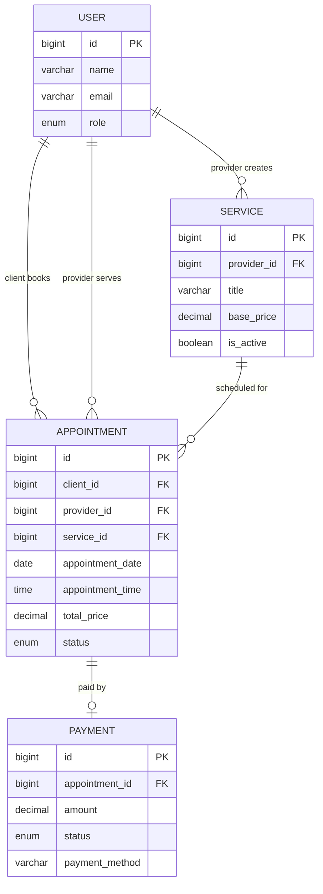
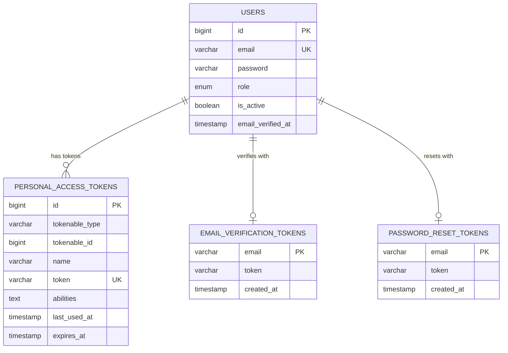
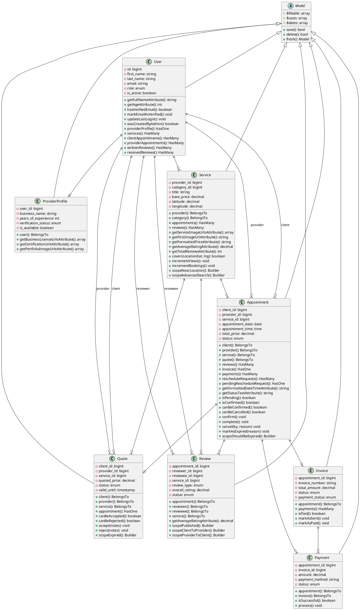
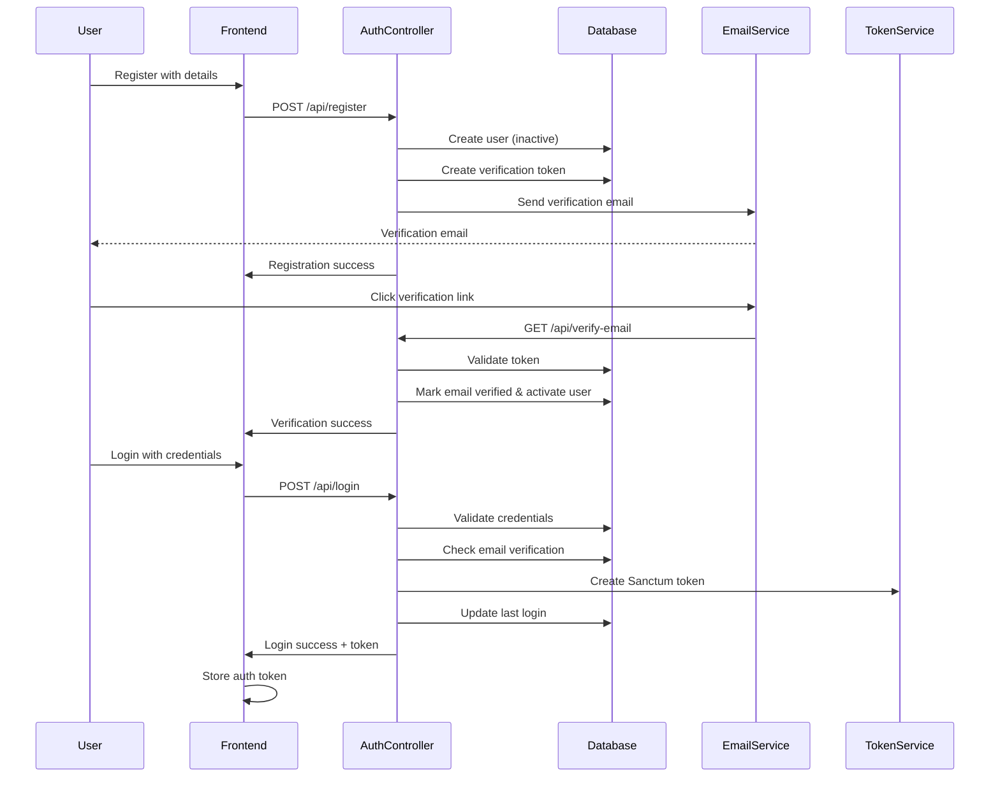
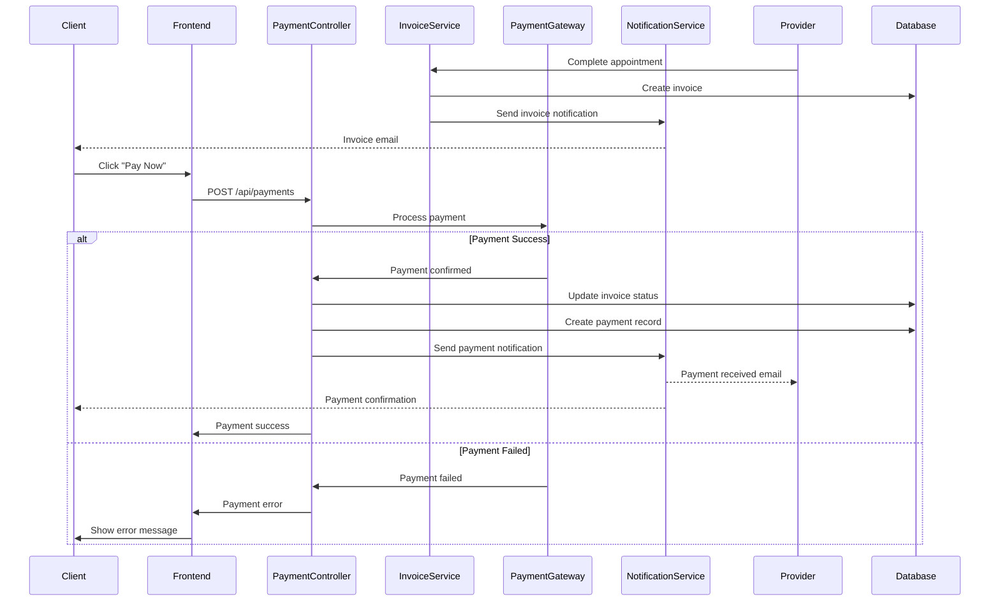
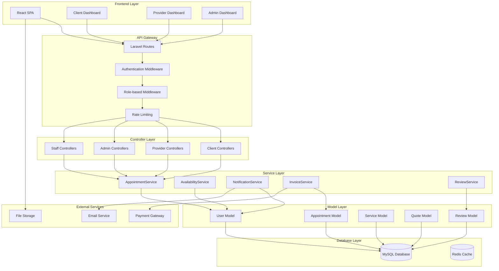
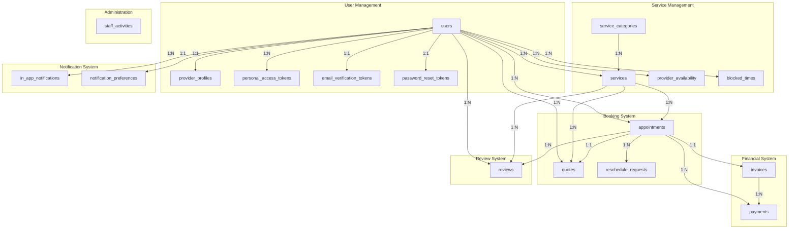

# HireMe Project - Dissertation Diagrams Guide

## Table of Contents
1. [Entity-Relationship (ER) Diagrams](#entity-relationship-er-diagrams)
2. [Class Diagrams](#class-diagrams)
3. [Sequence Diagrams](#sequence-diagrams)
4. [Architecture Diagrams](#architecture-diagrams)
5. [Tools and Software Recommendations](#tools-and-software-recommendations)

---

## Entity-Relationship (ER) Diagrams

### 1. Complete System ER Diagram

**Purpose**: Shows all entities, attributes, and relationships in the system.

#### Entities and Key Attributes:

```mermaid
erDiagram
    USERS {
        bigint id PK
        varchar first_name
        varchar last_name
        varchar email UK
        varchar password
        enum role
        varchar address
        varchar contact_number
        date date_of_birth
        varchar profile_picture
        boolean is_active
        timestamp email_verified_at
        bigint created_by FK
        timestamp last_login_at
        timestamps created_at_updated_at
    }
    
    PROVIDER_PROFILES {
        bigint id PK
        bigint user_id FK
        varchar business_name
        integer years_of_experience
        text bio
        integer service_area_radius
        json service_areas
        decimal total_earnings
        decimal average_rating
        integer total_reviews
        enum verification_status
        json business_license_urls
        json certification_urls
        json portfolio_image_urls
        boolean is_available
        timestamp verified_at
        timestamps created_at_updated_at
    }
    
    SERVICES {
        bigint id PK
        bigint provider_id FK
        bigint category_id FK
        varchar title
        text description
        enum pricing_type
        decimal base_price
        decimal duration_hours
        json service_images
        text requirements
        text includes
        json service_areas
        decimal latitude
        decimal longitude
        varchar location_address
        varchar location_city
        varchar location_neighborhood
        integer service_radius
        boolean is_active
        integer views_count
        integer bookings_count
        timestamps created_at_updated_at
    }
    
    SERVICE_CATEGORIES {
        bigint id PK
        varchar name UK
        varchar description
        varchar icon
        varchar color
        boolean is_active
        integer service_count
        timestamps created_at_updated_at
    }
    
    APPOINTMENTS {
        bigint id PK
        bigint client_id FK
        bigint provider_id FK
        bigint service_id FK
        bigint quote_id FK
        date appointment_date
        time appointment_time
        integer duration_hours
        decimal total_price
        decimal base_price
        decimal travel_fee
        enum location_type
        varchar client_address
        varchar client_city
        varchar client_postal_code
        text location_instructions
        varchar client_phone
        varchar client_email
        enum contact_preference
        text client_notes
        text provider_notes
        enum payment_method
        enum status
        varchar booking_source
        timestamp confirmed_at
        timestamp started_at
        timestamp completed_at
        timestamp cancelled_at
        varchar cancellation_reason
        timestamp invoice_sent_at
        timestamp payment_received_at
        timestamp reviews_completed_at
        timestamp expires_at
        boolean auto_expired
        timestamp reminder_24h_sent_at
        timestamps created_at_updated_at
    }
    
    QUOTES {
        bigint id PK
        bigint client_id FK
        bigint provider_id FK
        bigint service_id FK
        varchar title
        text description
        text client_requirements
        decimal quoted_price
        decimal duration_hours
        text quote_details
        text terms_and_conditions
        enum status
        timestamp valid_until
        text client_response_notes
        text provider_notes
        timestamp quoted_at
        timestamp responded_at
        timestamps created_at_updated_at
    }
    
    REVIEWS {
        bigint id PK
        bigint appointment_id FK
        bigint reviewer_id FK
        bigint reviewee_id FK
        bigint service_id FK
        enum review_type
        decimal overall_rating
        decimal quality_rating
        decimal punctuality_rating
        decimal communication_rating
        decimal value_rating
        text review_text
        json helpful_votes
        enum status
        boolean is_hidden
        boolean is_verified
        text admin_notes
        text provider_response
        timestamp provider_responded_at
        timestamps created_at_updated_at
    }
    
    INVOICES {
        bigint id PK
        bigint appointment_id FK
        varchar invoice_number UK
        decimal subtotal
        decimal tax_amount
        decimal total_amount
        text line_items
        enum status
        enum payment_status
        enum payment_method
        date due_date
        text notes
        timestamp sent_at
        timestamp paid_at
        json payment_details
        timestamps created_at_updated_at
    }
    
    PAYMENTS {
        bigint id PK
        bigint appointment_id FK
        bigint invoice_id FK
        varchar payment_method
        decimal amount
        enum status
        varchar transaction_id
        json payment_details
        timestamp processed_at
        timestamps created_at_updated_at
    }
    
    RESCHEDULE_REQUESTS {
        bigint id PK
        bigint appointment_id FK
        bigint requested_by FK
        date requested_date
        time requested_time
        varchar client_phone
        varchar client_email
        varchar client_address
        enum location_type
        text reason
        enum status
        text response_notes
        bigint responded_by FK
        timestamp responded_at
        timestamps created_at_updated_at
    }

    %% Relationships
    USERS ||--o| PROVIDER_PROFILES : "has profile"
    USERS ||--o{ SERVICES : "provides"
    USERS ||--o{ APPOINTMENTS : "books as client"
    USERS ||--o{ APPOINTMENTS : "serves as provider"
    USERS ||--o{ QUOTES : "requests"
    USERS ||--o{ QUOTES : "responds to"
    USERS ||--o{ REVIEWS : "writes"
    USERS ||--o{ REVIEWS : "receives"
    USERS ||--o{ RESCHEDULE_REQUESTS : "requests"
    
    SERVICE_CATEGORIES ||--o{ SERVICES : "categorizes"
    
    SERVICES ||--o{ APPOINTMENTS : "booked for"
    SERVICES ||--o{ QUOTES : "quoted for"
    SERVICES ||--o{ REVIEWS : "reviewed for"
    
    APPOINTMENTS ||--o| QUOTES : "created from"
    APPOINTMENTS ||--o{ REVIEWS : "generates"
    APPOINTMENTS ||--o| INVOICES : "billed by"
    APPOINTMENTS ||--o{ PAYMENTS : "paid by"
    APPOINTMENTS ||--o{ RESCHEDULE_REQUESTS : "has requests"
    
    INVOICES ||--o{ PAYMENTS : "settled by"
```



### 2. Core Business Entities ER Diagram

**Purpose**: Focuses on the main business flow (User → Service → Appointment → Payment).

#### Simplified Business Flow:



### 3. Authentication & Authorization ER Diagram

**Purpose**: Shows user management, roles, and security-related entities.



---

## Class Diagrams

### 1. Model Layer Class Diagram

**Purpose**: Shows the structure of all Eloquent models and their relationships.



### 2. Service Layer Class Diagram

**Purpose**: Shows the business logic layer and service classes.

```plantuml
@startuml Service_Layer_Classes

abstract class BaseService {
    # validateInput(data): void
    # handleException(e): void
}

class AppointmentService extends BaseService {
    - availabilityService: AvailabilityService
    + __construct(AvailabilityService)
    + createBooking(User, array): array
    + createBookingWithRetry(User, array, int): array
    + createAppointmentWithLocking(User, Service, array): Appointment
    + respondToAppointment(User, Appointment, string, array): Appointment
    + createQuote(User, array): Quote
    + respondToQuote(User, Quote, string, array): array
    + getAppointments(User, array): Builder
    + getQuotes(User, array): Builder
    + markExpiredQuotes(): int
    + getAppointmentStatistics(User): array
    - createDirectAppointment(User, Service, array): Appointment
    - createQuoteRequest(User, Service, array): Quote
}

class AvailabilityService extends BaseService {
    + checkProviderAvailability(User, string, string, string): array
    + getAvailableTimeSlots(User, string): array
    + isAvailableAt(User, string, string, string): array
    + createAvailability(User, array): ProviderAvailability
    + updateAvailability(User, int, array): ProviderAvailability
    + blockTime(User, array): BlockedTime
    + getBlockedTimes(User): Collection
    + removeBlockedTime(User, int): bool
    - hasConflictingAppointments(User, string, string, string): boolean
    - hasBlockedTime(User, string, string, string): boolean
}

class NotificationService extends BaseService {
    + sendAppointmentNotification(Appointment, string): void
    + sendQuoteNotification(Quote, string): void
    + sendInvoiceNotification(Invoice): void
    + sendPaymentNotification(Payment): void
    + sendReviewNotification(Review): void
    + createInAppNotification(User, string, array): InAppNotification
    + getUserNotifications(User, array): LengthAwarePaginator
    + markAsRead(User, int): bool
    + markAllAsRead(User): int
    + getUnreadCount(User): int
    - shouldSendNotification(User, string): boolean
    - formatNotificationData(array): array
}

class InvoiceService extends BaseService {
    + createInvoiceFromAppointment(Appointment, array): Invoice
    + generateInvoiceNumber(): string
    + sendInvoice(Invoice): bool
    + markInvoiceAsPaid(Invoice, Payment): void
    + getInvoicesForProvider(User, array): LengthAwarePaginator
    + getInvoiceStatistics(User): array
    - calculateTaxAmount(decimal): decimal
    - formatInvoiceData(Invoice): array
}

class ReviewService extends BaseService {
    + createReview(User, Appointment, array): Review
    + updateProviderRating(User): void
    + updateServiceRating(Service): void
    + getReviewsForProvider(User, array): LengthAwarePaginator
    + getReviewsForService(Service, array): LengthAwarePaginator
    + flagReview(Review, string): void
    + moderateReview(Review, string): void
    - calculateAverageRating(Collection): decimal
    - updateAggregateRatings(User): void
}

class ProviderProfileService extends BaseService {
    + createProviderProfile(User, array): ProviderProfile
    + updateProfile(User, array): ProviderProfile
    + uploadDocuments(User, array): array
    + verifyProvider(ProviderProfile, User): ProviderProfile
    + toggleAvailability(User): ProviderProfile
    + getStatistics(User): array
    - processDocumentUploads(array): array
    - validateBusinessLicense(file): bool
}

class StatisticsService extends BaseService {
    + getProviderStatistics(User): array
    + getClientStatistics(User): array
    + getAdminStatistics(): array
    + getRevenueStatistics(User, string): array
    + getAppointmentTrends(User, string): array
    + getPopularServices(int): Collection
    + getTopProviders(int): Collection
    - calculateGrowthPercentage(current, previous): decimal
    - formatChartData(array): array
}

' Relationships
AppointmentService --> AvailabilityService : uses
AppointmentService --> NotificationService : notifies
InvoiceService --> NotificationService : notifies
ReviewService --> NotificationService : notifies
ProviderProfileService --> NotificationService : notifies

@enduml
```



### 3. Controller Layer Class Diagram

**Purpose**: Shows the API controller structure and role-based organization.

```plantuml
@startuml Controller_Layer_Classes

abstract class Controller {
    # middleware: array
    # validate(Request, array): array
    # respondWithSuccess(data, message): JsonResponse
    # respondWithError(message, code): JsonResponse
}

class AuthController extends Controller {
    - providerProfileService: ProviderProfileService
    + register(RegisterRequest): JsonResponse
    + login(LoginRequest): JsonResponse
    + logout(Request): JsonResponse
    + user(Request): JsonResponse
    + verifyEmail(Request): JsonResponse
    + resendVerification(Request): JsonResponse
    + forgotPassword(Request): JsonResponse
    + resetPassword(Request): JsonResponse
    + validateResetToken(Request): JsonResponse
}

namespace Client {
    class AppointmentController extends Controller {
        - appointmentService: AppointmentService
        + index(Request): JsonResponse
        + store(BookingRequest): JsonResponse
        + show(Appointment): JsonResponse
        + cancel(Request, Appointment): JsonResponse
        + reschedule(Request, Appointment): JsonResponse
        + todayForDashboard(): JsonResponse
        + upcomingForDashboard(): JsonResponse
        + pastForDashboard(): JsonResponse
        + dashboardStats(): JsonResponse
        - transformAppointmentForClient(Appointment): array
        - canCancelAppointment(Appointment): boolean
    }

    class ServiceController extends Controller {
        + index(Request): JsonResponse
        + show(Service): JsonResponse
        + search(Request): JsonResponse
        + nearbyServices(Request): JsonResponse
        + categories(): JsonResponse
        + popularServices(): JsonResponse
        + providerServices(User): JsonResponse
        - transformServiceForClient(Service): array
    }

    class QuoteController extends Controller {
        - appointmentService: AppointmentService
        + index(Request): JsonResponse
        + store(ClientQuoteRequest): JsonResponse
        + show(Quote): JsonResponse
        + respond(Request, Quote): JsonResponse
        + dashboardStats(): JsonResponse
        - transformQuoteForClient(Quote): array
    }
}

namespace Provider {
    class AppointmentController extends Controller {
        - appointmentService: AppointmentService
        - invoiceService: InvoiceService
        + index(Request): JsonResponse
        + show(Appointment): JsonResponse
        + updateStatus(Request, Appointment): JsonResponse
        + completeService(Request, Appointment): JsonResponse
        + approveReschedule(Request, Appointment): JsonResponse
        + declineReschedule(Request, Appointment): JsonResponse
        + todayForDashboard(): JsonResponse
        + dashboardStats(): JsonResponse
        - transformAppointmentForProvider(Appointment): array
        - canStartService(Appointment): boolean
        - createInvoiceForCompletedAppointment(Appointment): Invoice
    }

    class ServiceController extends Controller {
        - serviceService: ServiceService
        + index(Request): JsonResponse
        + store(ServiceRequest): JsonResponse
        + show(Service): JsonResponse
        + update(ServiceRequest, Service): JsonResponse
        + destroy(Service): JsonResponse
        + toggleStatus(Service): JsonResponse
        + uploadImages(Request, Service): JsonResponse
        + deleteImage(Request, Service): JsonResponse
        - transformServiceForProvider(Service): array
    }

    class QuoteController extends Controller {
        - appointmentService: AppointmentService
        + index(Request): JsonResponse
        + store(QuoteRequest): JsonResponse
        + update(QuoteResponseRequest, Quote): JsonResponse
        + show(Quote): JsonResponse
        + dashboardStats(): JsonResponse
        - transformQuoteForProvider(Quote): array
    }

    class InvoiceController extends Controller {
        - invoiceService: InvoiceService
        + index(Request): JsonResponse
        + store(Request): JsonResponse
        + show(Invoice): JsonResponse
        + send(Invoice): JsonResponse
        + markPaid(Request, Invoice): JsonResponse
        + dashboardStats(): JsonResponse
        - transformInvoiceForProvider(Invoice): array
    }
}

namespace Admin {
    class UserController extends Controller {
        + index(Request): JsonResponse
        + store(Request): JsonResponse
        + show(User): JsonResponse
        + update(Request, User): JsonResponse
        + destroy(User): JsonResponse
        + toggleStatus(User): JsonResponse
        + resetPassword(Request, User): JsonResponse
        - transformUserForAdmin(User): array
    }

    class DashboardController extends Controller {
        - statisticsService: StatisticsService
        + index(): JsonResponse
        + userGrowth(Request): JsonResponse
        + revenueAnalytics(Request): JsonResponse
        + appointmentTrends(Request): JsonResponse
        + topProviders(): JsonResponse
        + systemHealth(): JsonResponse
    }

    class ReportController extends Controller {
        - reportService: ReportService
        + userReport(Request): JsonResponse
        + appointmentReport(Request): JsonResponse
        + revenueReport(Request): JsonResponse
        + serviceReport(Request): JsonResponse
        + exportReport(Request): Response
    }
}

namespace Staff {
    class ServiceController extends Controller {
        + index(Request): JsonResponse
        + show(Service): JsonResponse
        + approve(Service): JsonResponse
        + reject(Request, Service): JsonResponse
        + feature(Service): JsonResponse
        + unfeature(Service): JsonResponse
        - transformServiceForStaff(Service): array
    }

    class AppointmentController extends Controller {
        + index(Request): JsonResponse
        + show(Appointment): JsonResponse
        + intervene(Request, Appointment): JsonResponse
        + refund(Request, Appointment): JsonResponse
        - transformAppointmentForStaff(Appointment): array
    }
}

' Service Injection Relationships
Client.AppointmentController --> AppointmentService : uses
Provider.AppointmentController --> AppointmentService : uses
Provider.AppointmentController --> InvoiceService : uses
Client.QuoteController --> AppointmentService : uses
Provider.QuoteController --> AppointmentService : uses
Provider.InvoiceController --> InvoiceService : uses
Admin.DashboardController --> StatisticsService : uses

@enduml
```



---

## Sequence Diagrams

### 1. Appointment Booking Flow

```mermaid
sequenceDiagram
    participant Client
    participant Frontend
    participant API
    participant AppointmentService
    participant AvailabilityService
    participant Database
    participant NotificationService

    Client->>Frontend: Select service & time
    Frontend->>API: POST /api/client/appointments
    API->>AppointmentService: createBooking(client, data)
    
    alt Direct Appointment
        AppointmentService->>AppointmentService: createBookingWithRetry()
        loop Retry Logic (max 3 attempts)
            AppointmentService->>Database: BEGIN TRANSACTION
            AppointmentService->>Database: SELECT...FOR UPDATE (lock provider schedule)
            AppointmentService->>AvailabilityService: isAvailableAt()
            AvailabilityService->>Database: Check conflicts
            
            alt Available
                AppointmentService->>Database: INSERT appointment
                AppointmentService->>Database: COMMIT
                AppointmentService->>NotificationService: sendAppointmentNotification()
                NotificationService-->>Provider: Email notification
                NotificationService-->>Client: Confirmation email
                break Success
            else Conflict Detected
                AppointmentService->>Database: ROLLBACK
                AppointmentService->>AppointmentService: Wait + retry
            end
        end
    else Quote Request
        AppointmentService->>Database: INSERT quote
        AppointmentService->>NotificationService: sendQuoteNotification()
        NotificationService-->>Provider: Quote request email
    end
    
    AppointmentService->>API: Return result
    API->>Frontend: JSON response
    Frontend->>Client: Show confirmation/quote request
```

### 2. User Authentication Flow



### 3. Payment Processing Flow



---

## Architecture Diagrams

### 1. System Architecture Overview



### 2. Database Schema Architecture



---

## Tools and Software Recommendations

### 1. Diagram Creation Tools

#### Professional/Academic Tools:
1. **Lucidchart** (Recommended for dissertation)
   - Web-based, collaborative
   - Professional templates
   - Export to multiple formats
   - Academic discounts available

2. **Draw.io (now diagrams.net)**
   - Free, web-based
   - Extensive shape libraries
   - Integration with Google Drive/OneDrive
   - Professional output quality

3. **Enterprise Architect**
   - Professional UML tool
   - Code reverse engineering
   - Extensive modeling capabilities
   - Academic licenses available

4. **Visual Paradigm**
   - Complete modeling suite
   - Database design tools
   - Academic version available
   - High-quality exports

#### Free/Open Source Tools:
1. **PlantUML** (Used in examples above)
   - Text-based diagrams
   - Version control friendly
   - Professional output
   - IDE integrations

2. **Mermaid** (Used in examples above)
   - Markdown-integrated
   - GitHub/GitLab support
   - Live editors available
   - Modern syntax

3. **yEd**
   - Free desktop application
   - Automatic layout algorithms
   - Professional appearance
   - Java-based, cross-platform

### 2. Database Design Tools

1. **MySQL Workbench**
   - Free from Oracle
   - Direct database connection
   - Forward/reverse engineering
   - Professional ER diagrams

2. **phpMyAdmin**
   - Web-based interface
   - Built-in designer
   - Export capabilities
   - Usually pre-installed with Laravel

3. **dbdiagram.io**
   - Web-based, simple syntax
   - Collaborative features
   - Export to multiple formats
   - Free tier available

### 3. Code Documentation Tools

1. **phpDocumentor**
   - Generate documentation from PHP code
   - Class diagrams from code
   - Professional output
   - Laravel compatible

2. **Doxygen**
   - Multi-language support
   - Call graphs and class hierarchies
   - Multiple output formats
   - Extensive customization

### 4. Presentation Tools for Dissertation

1. **LaTeX + TikZ**
   - Academic standard
   - High-quality vector graphics
   - Precise control over layout
   - Version control friendly

2. **Microsoft Visio**
   - Professional standard
   - Extensive template library
   - Integration with Office suite
   - Academic licensing

---

## Diagram Creation Guidelines for Dissertation

### 1. Academic Standards
- Use consistent notation (UML 2.5 standard)
- Include legends and explanations
- Use professional color schemes
- Ensure readability at various sizes
- Include proper citations for diagram types

### 2. Content Organization
- Start with high-level architecture
- Progress to detailed component diagrams
- Show both static structure and dynamic behavior
- Include error scenarios in sequence diagrams
- Document design decisions and trade-offs

### 3. Technical Details to Include
- Primary keys and foreign keys in ER diagrams
- Method signatures in class diagrams
- Database constraints and indexes
- Security boundaries and access controls
- Performance considerations

### 4. Formatting for Academic Use
- Vector formats (SVG, PDF) for scalability
- High contrast for black/white printing
- Consistent font sizes (minimum 10pt)
- Clear labeling and annotations
- Professional layout and spacing

This guide provides you with comprehensive documentation for creating all necessary diagrams for your dissertation. The combination of different diagram types will give a complete picture of your system's architecture, data design, and behavior patterns.