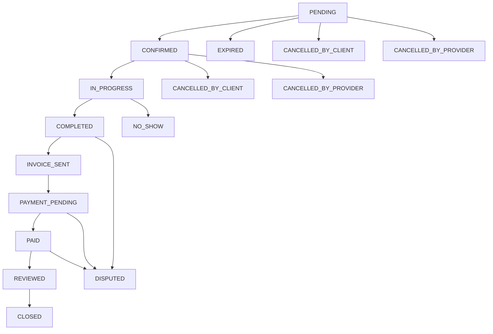

# Email and In-App Notifications Implementation Plan
## HireMe Service Marketplace Platform

**Document Version:** 1.0  
**Date:** January 2025  
**Status:** Implementation Ready

---

## Table of Contents

1. [Executive Summary](#executive-summary)
2. [Current Infrastructure Analysis](#current-infrastructure-analysis)
3. [Appointment Booking Flow Analysis](#appointment-booking-flow-analysis)
4. [Gap Analysis](#gap-analysis)
5. [Implementation Plan](#implementation-plan)
6. [Technical Specifications](#technical-specifications)
7. [Database Schema Changes](#database-schema-changes)
8. [Backend Implementation](#backend-implementation)
9. [Frontend Implementation](#frontend-implementation)
10. [Testing Strategy](#testing-strategy)
11. [Deployment Plan](#deployment-plan)
12. [Maintenance and Monitoring](#maintenance-and-monitoring)

---

## Executive Summary

This document outlines a comprehensive plan to implement email and in-app notifications for the HireMe service marketplace platform, specifically focusing on the appointment booking business flow. The analysis reveals that while basic email notifications exist, significant gaps remain in providing users with complete visibility into appointment lifecycle events.

### Key Findings
- **Existing Infrastructure:** 5 email notification classes, basic frontend toast system
- **Coverage Gap:** ~70% of appointment lifecycle events lack notifications
- **Missing Features:** In-app notification center, real-time updates, comprehensive status tracking

### Recommended Solution
A phased implementation approach delivering:
- Complete email notification coverage for all appointment states
- Modern in-app notification system with real-time updates
- Unified notification management across channels
- Enhanced user engagement and platform transparency

---

## Current Infrastructure Analysis

### Backend Notification Infrastructure

#### Existing Models and Traits
```php
// User Model - app/Models/User.php:16
use Illuminate\Notifications\Notifiable;

// Appointment Model - app/Models/Appointment.php
- Comprehensive status constants (14 states)
- Status transition methods
- Event integration ready
```

#### Current Email System
**Location:** `app/Mail/`

| Mail Class | Purpose | Triggers | Recipients |
|------------|---------|----------|------------|
| `AppointmentBookingConfirmation` | Booking receipt | Appointment creation | Client |
| `AppointmentProviderNotification` | New booking alert | Appointment creation | Provider |
| `AppointmentExpiredClient` | Timeout notice | 24hr expiry | Client |
| `AppointmentExpiredProvider` | Timeout notice | 24hr expiry | Provider |
| `AppointmentExpiredNotification` | General expiry | Console command | Both |

**Email Templates:** `resources/views/emails/appointments/`
- Professional styling with Bootstrap
- Action buttons for provider responses
- Comprehensive appointment details
- Expiration timers and deadlines

#### Event System
```php
// app/Events/AppointmentStatusChanged.php
class AppointmentStatusChanged
{
    public $appointment;
    public $oldStatus;
    public $newStatus;
}
```

### Frontend Notification System

#### Current Implementation
**File:** `resources/js/services/notificationService.js`

```javascript
class NotificationService {
    success(message) { /* DOM-based toast */ }
    error(message) { /* DOM-based toast */ }
    warning(message) { /* DOM-based toast */ }
    info(message) { /* DOM-based toast */ }
}
```

**Features:**
- Bootstrap-styled alerts
- Slide-in animations
- Auto-dismiss (5 seconds)
- No persistence or state management

#### Technology Stack
- **Frontend:** React 19, Bootstrap 5
- **Backend:** Laravel 10.x, PHP 8.1+
- **Notifications:** Laravel Sanctum, Mail system
- **Database:** MySQL

---

## Appointment Booking Flow Analysis

### Appointment Status Lifecycle



### Current Notification Coverage

#### ✅ Implemented Notifications
| Event | Email | In-App | Recipients |
|-------|-------|---------|------------|
| Appointment Created | ✅ | ❌ | Client, Provider |
| Appointment Expired | ✅ | ❌ | Client, Provider |

#### ❌ Missing Critical Notifications
| Event | Impact | Priority | Recipients |
|-------|--------|----------|------------|
| Provider Confirms | High | Critical | Client |
| Provider Declines | High | Critical | Client |
| Service Started | Medium | High | Client |
| Service Completed | High | Critical | Client, Provider |
| Invoice Generated | High | Critical | Client |
| Payment Received | High | Critical | Provider |
| Reschedule Request | High | Critical | Provider |
| Reschedule Response | High | Critical | Client |
| Review Submitted | Medium | Medium | Provider |
| Dispute Created | High | Critical | Both |

### Key Integration Points

#### Client Appointment Controller
**File:** `app/Http/Controllers/API/Client/AppointmentController.php:535`
```php
// Current notification sending
private function sendAppointmentNotifications(Appointment $appointment)
{
    // Send booking confirmation to client
    Mail::to($appointment->client->email)->send(
        new AppointmentBookingConfirmation($appointment)
    );
    
    // Send notification to provider  
    Mail::to($appointment->provider->email)->send(
        new AppointmentProviderNotification($appointment)
    );
}
```

#### Provider Appointment Controller
**File:** `app/Http/Controllers/API/Provider/AppointmentController.php:195`
```php
// Status update method - missing notifications
public function updateStatus(Request $request, Appointment $appointment)
{
    // Status change logic exists
    // Missing: Notification dispatch
}
```

---

## Gap Analysis

### Missing Infrastructure Components

#### 1. Database Schema
- No in-app notifications table
- No notification preferences
- No notification history tracking

#### 2. Backend Services
- No centralized notification service
- Missing notification templates
- No notification scheduling
- No preference management

#### 3. Frontend Components
- No notification center
- No real-time updates
- No notification history
- No preference settings

#### 4. Real-time Communication
- No WebSocket/SSE implementation
- No push notification support
- No mobile integration

### Business Impact Assessment

#### User Experience Issues
- **Clients:** Lack awareness of appointment status changes
- **Providers:** Miss important booking updates
- **Both:** Poor communication leading to missed appointments

#### Operational Challenges
- Increased support tickets
- Manual communication overhead
- Reduced platform engagement
- Lost revenue from missed appointments

---

## Implementation Plan

### Phase 1: Foundation (Weeks 1-2)
**Goal:** Establish core notification infrastructure

#### 1.1 Database Schema
- Create `notifications` table (Laravel standard)
- Create `in_app_notifications` table (custom)
- Add notification preferences to users table

#### 1.2 Backend Services
- `NotificationService` class
- `InAppNotificationService` class
- Base notification templates

#### 1.3 API Endpoints
- Notification CRUD operations
- Preference management
- Mark as read functionality

### Phase 2: Email Expansion (Weeks 3-4)
**Goal:** Complete email notification coverage

#### 2.1 New Mail Classes
- `AppointmentConfirmedMail`
- `AppointmentDeclinedMail`
- `AppointmentStatusChangeMail`
- `InvoiceGeneratedMail`
- `PaymentReceivedMail`
- `RescheduleRequestMail`

#### 2.2 Email Templates
- Status change notifications
- Payment confirmations
- Reschedule communications
- Review reminders

#### 2.3 Integration Points
- Hook into existing controller methods
- Event listener implementation
- Queue configuration

### Phase 3: In-App Notifications (Weeks 5-6)
**Goal:** Real-time in-app notification system

#### 3.1 Frontend Components
- `NotificationCenter` component
- `NotificationItem` component
- `NotificationBadge` component
- `NotificationProvider` context

#### 3.2 API Integration
- Real-time updates via polling/WebSocket
- Notification state management
- Auto-refresh functionality

#### 3.3 User Interface
- Navigation bar integration
- Mobile-responsive design
- Accessibility compliance

### Phase 4: Advanced Features (Weeks 7-8)
**Goal:** Enhanced functionality and optimization

#### 4.1 Real-time Communication
- WebSocket/Server-Sent Events
- Push notification foundation
- Mobile app integration

#### 4.2 Personalization
- Notification preferences
- Channel selection (email/app/SMS)
- Frequency controls

#### 4.3 Analytics and Monitoring
- Notification delivery tracking
- User engagement metrics
- Performance monitoring

---

## Technical Specifications

### Database Schema Changes

#### notifications Table (Laravel Standard)
```sql
CREATE TABLE notifications (
    id CHAR(36) PRIMARY KEY,
    type VARCHAR(255) NOT NULL,
    notifiable_type VARCHAR(255) NOT NULL,
    notifiable_id BIGINT UNSIGNED NOT NULL,
    data JSON NOT NULL,
    read_at TIMESTAMP NULL,
    created_at TIMESTAMP NULL,
    updated_at TIMESTAMP NULL,
    INDEX notifications_notifiable_type_notifiable_id_index (notifiable_type, notifiable_id)
);
```

#### in_app_notifications Table (Custom)
```sql
CREATE TABLE in_app_notifications (
    id BIGINT UNSIGNED AUTO_INCREMENT PRIMARY KEY,
    user_id BIGINT UNSIGNED NOT NULL,
    title VARCHAR(255) NOT NULL,
    message TEXT NOT NULL,
    type ENUM('info', 'success', 'warning', 'error') DEFAULT 'info',
    category ENUM('appointment', 'payment', 'system', 'general') DEFAULT 'general',
    appointment_id BIGINT UNSIGNED NULL,
    quote_id BIGINT UNSIGNED NULL,
    is_read BOOLEAN DEFAULT FALSE,
    action_url VARCHAR(500) NULL,
    created_at TIMESTAMP DEFAULT CURRENT_TIMESTAMP,
    updated_at TIMESTAMP DEFAULT CURRENT_TIMESTAMP ON UPDATE CURRENT_TIMESTAMP,
    
    FOREIGN KEY (user_id) REFERENCES users(id) ON DELETE CASCADE,
    FOREIGN KEY (appointment_id) REFERENCES appointments(id) ON DELETE SET NULL,
    FOREIGN KEY (quote_id) REFERENCES quotes(id) ON DELETE SET NULL,
    
    INDEX idx_user_read (user_id, is_read),
    INDEX idx_category (category),
    INDEX idx_created_at (created_at)
);
```

#### notification_preferences Table
```sql
CREATE TABLE notification_preferences (
    id BIGINT UNSIGNED AUTO_INCREMENT PRIMARY KEY,
    user_id BIGINT UNSIGNED NOT NULL,
    notification_type VARCHAR(100) NOT NULL,
    email_enabled BOOLEAN DEFAULT TRUE,
    app_enabled BOOLEAN DEFAULT TRUE,
    sms_enabled BOOLEAN DEFAULT FALSE,
    created_at TIMESTAMP DEFAULT CURRENT_TIMESTAMP,
    updated_at TIMESTAMP DEFAULT CURRENT_TIMESTAMP ON UPDATE CURRENT_TIMESTAMP,
    
    FOREIGN KEY (user_id) REFERENCES users(id) ON DELETE CASCADE,
    UNIQUE KEY unique_user_type (user_id, notification_type)
);
```

---

## Backend Implementation

### Service Classes

#### NotificationService.php
```php
<?php

namespace App\Services;

use App\Models\User;
use App\Models\InAppNotification;
use Illuminate\Support\Facades\Mail;
use Illuminate\Support\Facades\Log;

class NotificationService
{
    public function sendAppointmentNotification(
        string $type,
        User $recipient,
        array $data,
        bool $sendEmail = true,
        bool $sendInApp = true
    ) {
        try {
            if ($sendEmail && $this->shouldSendEmail($recipient, $type)) {
                $this->sendEmailNotification($type, $recipient, $data);
            }
            
            if ($sendInApp && $this->shouldSendInApp($recipient, $type)) {
                $this->createInAppNotification($type, $recipient, $data);
            }
            
            Log::info("Notification sent", [
                'type' => $type,
                'recipient' => $recipient->id,
                'email' => $sendEmail,
                'in_app' => $sendInApp
            ]);
            
        } catch (\Exception $e) {
            Log::error("Notification failed", [
                'type' => $type,
                'recipient' => $recipient->id,
                'error' => $e->getMessage()
            ]);
        }
    }
    
    private function sendEmailNotification(string $type, User $recipient, array $data)
    {
        $mailClass = $this->getMailClass($type);
        if ($mailClass) {
            Mail::to($recipient->email)->send(new $mailClass($data));
        }
    }
    
    private function createInAppNotification(string $type, User $recipient, array $data)
    {
        $template = $this->getInAppTemplate($type);
        
        InAppNotification::create([
            'user_id' => $recipient->id,
            'title' => $template['title'],
            'message' => $this->renderMessage($template['message'], $data),
            'type' => $template['type'],
            'category' => $template['category'],
            'appointment_id' => $data['appointment_id'] ?? null,
            'action_url' => $this->generateActionUrl($type, $data),
        ]);
    }
}
```

### Event Listeners

#### SendAppointmentStatusNotification.php
```php
<?php

namespace App\Listeners;

use App\Events\AppointmentStatusChanged;
use App\Services\NotificationService;

class SendAppointmentStatusNotification
{
    protected $notificationService;
    
    public function __construct(NotificationService $notificationService)
    {
        $this->notificationService = $notificationService;
    }
    
    public function handle(AppointmentStatusChanged $event)
    {
        $appointment = $event->appointment;
        $oldStatus = $event->oldStatus;
        $newStatus = $event->newStatus;
        
        // Determine recipients and notification types
        $notifications = $this->getNotificationsForStatusChange($oldStatus, $newStatus);
        
        foreach ($notifications as $notification) {
            $this->notificationService->sendAppointmentNotification(
                $notification['type'],
                $notification['recipient'],
                [
                    'appointment' => $appointment,
                    'old_status' => $oldStatus,
                    'new_status' => $newStatus,
                    'appointment_id' => $appointment->id
                ]
            );
        }
    }
    
    private function getNotificationsForStatusChange(string $oldStatus, string $newStatus): array
    {
        $notifications = [];
        
        switch ($newStatus) {
            case 'confirmed':
                $notifications[] = [
                    'type' => 'appointment_confirmed',
                    'recipient' => $appointment->client
                ];
                break;
                
            case 'cancelled_by_provider':
                $notifications[] = [
                    'type' => 'appointment_cancelled_by_provider',
                    'recipient' => $appointment->client
                ];
                break;
                
            case 'completed':
                $notifications[] = [
                    'type' => 'appointment_completed',
                    'recipient' => $appointment->client
                ];
                break;
                
            // Add more cases as needed
        }
        
        return $notifications;
    }
}
```

### API Controllers

#### NotificationController.php
```php
<?php

namespace App\Http\Controllers\API;

use App\Http\Controllers\Controller;
use App\Models\InAppNotification;
use Illuminate\Http\Request;
use Illuminate\Support\Facades\Auth;

class NotificationController extends Controller
{
    public function index(Request $request)
    {
        $query = InAppNotification::where('user_id', Auth::id())
            ->orderBy('created_at', 'desc');
            
        if ($request->unread_only) {
            $query->where('is_read', false);
        }
        
        if ($request->category) {
            $query->where('category', $request->category);
        }
        
        $notifications = $query->paginate($request->per_page ?? 20);
        
        return response()->json([
            'success' => true,
            'data' => $notifications,
            'unread_count' => InAppNotification::where('user_id', Auth::id())
                ->where('is_read', false)
                ->count()
        ]);
    }
    
    public function markAsRead(InAppNotification $notification)
    {
        if ($notification->user_id !== Auth::id()) {
            return response()->json(['error' => 'Unauthorized'], 403);
        }
        
        $notification->update(['is_read' => true]);
        
        return response()->json(['success' => true]);
    }
    
    public function markAllAsRead()
    {
        InAppNotification::where('user_id', Auth::id())
            ->where('is_read', false)
            ->update(['is_read' => true]);
            
        return response()->json(['success' => true]);
    }
    
    public function delete(InAppNotification $notification)
    {
        if ($notification->user_id !== Auth::id()) {
            return response()->json(['error' => 'Unauthorized'], 403);
        }
        
        $notification->delete();
        
        return response()->json(['success' => true]);
    }
}
```

---

## Frontend Implementation

### React Context Provider

#### NotificationContext.jsx
```jsx
import React, { createContext, useContext, useState, useEffect } from 'react';
import { notificationService } from '../services/notificationService';

const NotificationContext = createContext();

export const useNotifications = () => {
    const context = useContext(NotificationContext);
    if (!context) {
        throw new Error('useNotifications must be used within NotificationProvider');
    }
    return context;
};

export const NotificationProvider = ({ children }) => {
    const [notifications, setNotifications] = useState([]);
    const [unreadCount, setUnreadCount] = useState(0);
    const [loading, setLoading] = useState(false);

    const fetchNotifications = async (params = {}) => {
        setLoading(true);
        try {
            const response = await notificationService.getNotifications(params);
            setNotifications(response.data.data);
            setUnreadCount(response.data.unread_count);
        } catch (error) {
            console.error('Failed to fetch notifications:', error);
        } finally {
            setLoading(false);
        }
    };

    const markAsRead = async (notificationId) => {
        try {
            await notificationService.markAsRead(notificationId);
            setNotifications(prev => 
                prev.map(n => 
                    n.id === notificationId ? { ...n, is_read: true } : n
                )
            );
            setUnreadCount(prev => Math.max(0, prev - 1));
        } catch (error) {
            console.error('Failed to mark notification as read:', error);
        }
    };

    const markAllAsRead = async () => {
        try {
            await notificationService.markAllAsRead();
            setNotifications(prev => 
                prev.map(n => ({ ...n, is_read: true }))
            );
            setUnreadCount(0);
        } catch (error) {
            console.error('Failed to mark all notifications as read:', error);
        }
    };

    const deleteNotification = async (notificationId) => {
        try {
            await notificationService.deleteNotification(notificationId);
            setNotifications(prev => 
                prev.filter(n => n.id !== notificationId)
            );
        } catch (error) {
            console.error('Failed to delete notification:', error);
        }
    };

    useEffect(() => {
        fetchNotifications();
        
        // Set up polling for new notifications
        const interval = setInterval(() => {
            fetchNotifications({ unread_only: true });
        }, 30000); // Poll every 30 seconds

        return () => clearInterval(interval);
    }, []);

    const value = {
        notifications,
        unreadCount,
        loading,
        fetchNotifications,
        markAsRead,
        markAllAsRead,
        deleteNotification,
    };

    return (
        <NotificationContext.Provider value={value}>
            {children}
        </NotificationContext.Provider>
    );
};
```

### Notification Center Component

#### NotificationCenter.jsx
```jsx
import React, { useState } from 'react';
import { useNotifications } from '../../context/NotificationContext';
import NotificationItem from './NotificationItem';
import NotificationBadge from './NotificationBadge';

const NotificationCenter = () => {
    const [isOpen, setIsOpen] = useState(false);
    const { 
        notifications, 
        unreadCount, 
        loading, 
        markAllAsRead, 
        fetchNotifications 
    } = useNotifications();

    const handleToggle = () => {
        setIsOpen(!isOpen);
        if (!isOpen && unreadCount > 0) {
            // Mark as viewed when opened
            setTimeout(() => markAllAsRead(), 1000);
        }
    };

    return (
        <div className="notification-center position-relative">
            <button
                className="btn btn-link position-relative p-2"
                onClick={handleToggle}
                aria-label={`Notifications (${unreadCount} unread)`}
            >
                <i className="fas fa-bell fs-5"></i>
                {unreadCount > 0 && <NotificationBadge count={unreadCount} />}
            </button>

            {isOpen && (
                <div className="notification-dropdown position-absolute end-0 mt-2 bg-white border rounded shadow-lg">
                    <div className="notification-header d-flex justify-content-between align-items-center p-3 border-bottom">
                        <h6 className="mb-0">Notifications</h6>
                        <div className="d-flex gap-2">
                            <button 
                                className="btn btn-sm btn-outline-secondary"
                                onClick={() => fetchNotifications()}
                                disabled={loading}
                            >
                                <i className="fas fa-sync-alt"></i>
                            </button>
                            {unreadCount > 0 && (
                                <button 
                                    className="btn btn-sm btn-outline-primary"
                                    onClick={markAllAsRead}
                                >
                                    Mark all read
                                </button>
                            )}
                        </div>
                    </div>

                    <div className="notification-list" style={{ maxHeight: '400px', overflowY: 'auto' }}>
                        {loading ? (
                            <div className="text-center p-4">
                                <div className="spinner-border spinner-border-sm" role="status">
                                    <span className="visually-hidden">Loading...</span>
                                </div>
                            </div>
                        ) : notifications.length === 0 ? (
                            <div className="text-center text-muted p-4">
                                <i className="fas fa-bell-slash fs-3 mb-2"></i>
                                <p className="mb-0">No notifications</p>
                            </div>
                        ) : (
                            notifications.map(notification => (
                                <NotificationItem 
                                    key={notification.id} 
                                    notification={notification}
                                    onClose={() => setIsOpen(false)}
                                />
                            ))
                        )}
                    </div>

                    {notifications.length > 0 && (
                        <div className="notification-footer text-center p-2 border-top">
                            <button 
                                className="btn btn-sm btn-link"
                                onClick={() => {
                                    setIsOpen(false);
                                    // Navigate to full notifications page
                                    window.location.href = '/notifications';
                                }}
                            >
                                View all notifications
                            </button>
                        </div>
                    )}
                </div>
            )}
        </div>
    );
};

export default NotificationCenter;
```

### Enhanced Notification Service

#### Enhanced notificationService.js
```javascript
class NotificationService {
    constructor() {
        this.baseURL = '/api/notifications';
    }

    // Toast notifications (existing)
    success(message) {
        this.showToast(message, "success");
    }

    error(message) {
        this.showToast(message, "error");
    }

    warning(message) {
        this.showToast(message, "warning");
    }

    info(message) {
        this.showToast(message, "info");
    }

    // API methods for in-app notifications
    async getNotifications(params = {}) {
        const query = new URLSearchParams(params).toString();
        const response = await fetch(`${this.baseURL}?${query}`, {
            headers: {
                'Authorization': `Bearer ${localStorage.getItem('token')}`,
                'Accept': 'application/json',
            },
        });
        
        if (!response.ok) {
            throw new Error('Failed to fetch notifications');
        }
        
        return response.json();
    }

    async markAsRead(notificationId) {
        const response = await fetch(`${this.baseURL}/${notificationId}/read`, {
            method: 'POST',
            headers: {
                'Authorization': `Bearer ${localStorage.getItem('token')}`,
                'Accept': 'application/json',
            },
        });
        
        if (!response.ok) {
            throw new Error('Failed to mark notification as read');
        }
        
        return response.json();
    }

    async markAllAsRead() {
        const response = await fetch(`${this.baseURL}/mark-all-read`, {
            method: 'POST',
            headers: {
                'Authorization': `Bearer ${localStorage.getItem('token')}`,
                'Accept': 'application/json',
            },
        });
        
        if (!response.ok) {
            throw new Error('Failed to mark all notifications as read');
        }
        
        return response.json();
    }

    async deleteNotification(notificationId) {
        const response = await fetch(`${this.baseURL}/${notificationId}`, {
            method: 'DELETE',
            headers: {
                'Authorization': `Bearer ${localStorage.getItem('token')}`,
                'Accept': 'application/json',
            },
        });
        
        if (!response.ok) {
            throw new Error('Failed to delete notification');
        }
        
        return response.json();
    }

    // Toast notification implementation (existing + enhanced)
    showToast(message, type) {
        const notification = document.createElement("div");
        notification.className = `notification-toast alert alert-${this.getBootstrapClass(type)} position-fixed`;
        notification.style.cssText = `
            top: 20px;
            right: 20px;
            z-index: 9999;
            min-width: 300px;
            max-width: 400px;
            box-shadow: 0 4px 12px rgba(0, 0, 0, 0.15);
            border: none;
            animation: slideInRight 0.3s ease;
        `;

        notification.innerHTML = `
            <div class="d-flex justify-content-between align-items-center">
                <div class="d-flex align-items-center">
                    <i class="fas ${this.getIcon(type)} me-2"></i>
                    <span>${message}</span>
                </div>
                <button type="button" class="btn-close" onclick="this.parentElement.parentElement.remove()"></button>
            </div>
        `;

        document.body.appendChild(notification);

        setTimeout(() => {
            if (notification.parentElement) {
                notification.style.animation = "slideOutRight 0.3s ease";
                setTimeout(() => {
                    if (notification.parentElement) {
                        notification.remove();
                    }
                }, 300);
            }
        }, 5000);
    }

    getBootstrapClass(type) {
        const classes = {
            success: "success",
            error: "danger",
            warning: "warning",
            info: "info",
        };
        return classes[type] || "info";
    }

    getIcon(type) {
        const icons = {
            success: "fa-check-circle",
            error: "fa-exclamation-circle",
            warning: "fa-exclamation-triangle",
            info: "fa-info-circle",
        };
        return icons[type] || "fa-info-circle";
    }
}

// Enhanced CSS
const style = document.createElement("style");
style.textContent = `
    @keyframes slideInRight {
        from {
            transform: translateX(100%);
            opacity: 0;
        }
        to {
            transform: translateX(0);
            opacity: 1;
        }
    }
    
    @keyframes slideOutRight {
        from {
            transform: translateX(0);
            opacity: 1;
        }
        to {
            transform: translateX(100%);
            opacity: 0;
        }
    }

    .notification-dropdown {
        width: 380px;
        max-height: 500px;
        z-index: 1050;
        border-radius: 0.5rem;
        overflow: hidden;
    }

    .notification-item {
        transition: background-color 0.2s;
    }

    .notification-item:hover {
        background-color: #f8f9fa;
    }

    .notification-item.unread {
        background-color: #fff3cd;
        border-left: 4px solid #ffc107;
    }

    .notification-badge {
        position: absolute;
        top: -2px;
        right: -2px;
        min-width: 18px;
        height: 18px;
        border-radius: 50%;
        display: flex;
        align-items: center;
        justify-content: center;
        font-size: 0.75rem;
        font-weight: bold;
    }
`;
document.head.appendChild(style);

export default new NotificationService();
```

---

## Testing Strategy

### Unit Tests

#### Backend Tests
```php
// tests/Unit/NotificationServiceTest.php
class NotificationServiceTest extends TestCase
{
    public function test_sends_appointment_confirmation_notification()
    {
        // Arrange
        $client = User::factory()->create(['role' => 'client']);
        $appointment = Appointment::factory()->create(['client_id' => $client->id]);
        
        // Act
        $this->notificationService->sendAppointmentNotification(
            'appointment_confirmed',
            $client,
            ['appointment' => $appointment]
        );
        
        // Assert
        Mail::assertSent(AppointmentConfirmedMail::class);
        $this->assertDatabaseHas('in_app_notifications', [
            'user_id' => $client->id,
            'category' => 'appointment'
        ]);
    }
}
```

#### Frontend Tests
```javascript
// NotificationCenter.test.jsx
import { render, screen, fireEvent, waitFor } from '@testing-library/react';
import { NotificationProvider } from '../../context/NotificationContext';
import NotificationCenter from './NotificationCenter';

test('displays notification count badge', async () => {
    const mockNotifications = [
        { id: 1, title: 'Test', is_read: false },
        { id: 2, title: 'Test 2', is_read: false }
    ];
    
    // Mock API response
    global.fetch = jest.fn().mockResolvedValue({
        ok: true,
        json: () => Promise.resolve({
            data: { data: mockNotifications },
            unread_count: 2
        })
    });
    
    render(
        <NotificationProvider>
            <NotificationCenter />
        </NotificationProvider>
    );
    
    await waitFor(() => {
        expect(screen.getByText('2')).toBeInTheDocument();
    });
});
```

### Integration Tests

#### Email Integration Test
```php
// tests/Feature/AppointmentNotificationTest.php
class AppointmentNotificationTest extends TestCase
{
    public function test_appointment_confirmation_sends_notifications()
    {
        // Create test data
        $client = User::factory()->create(['role' => 'client']);
        $provider = User::factory()->create(['role' => 'service_provider']);
        $service = Service::factory()->create(['provider_id' => $provider->id]);
        
        // Make appointment booking request
        $response = $this->actingAs($client)->postJson('/api/client/appointments', [
            'service_id' => $service->id,
            'provider_id' => $provider->id,
            'appointment_date' => now()->addDay()->toDateString(),
            'appointment_time' => '10:00',
            'duration_hours' => 2,
            'total_price' => 100,
            'location_type' => 'client_address',
            'client_address' => '123 Test St',
            'payment_method' => 'cash',
            'agreed_to_terms' => true
        ]);
        
        // Assert appointment created
        $response->assertStatus(201);
        
        // Assert emails sent
        Mail::assertSent(AppointmentBookingConfirmation::class, function ($mail) use ($client) {
            return $mail->hasTo($client->email);
        });
        
        Mail::assertSent(AppointmentProviderNotification::class, function ($mail) use ($provider) {
            return $mail->hasTo($provider->email);
        });
        
        // Assert in-app notifications created
        $this->assertDatabaseHas('in_app_notifications', [
            'user_id' => $client->id,
            'category' => 'appointment'
        ]);
        
        $this->assertDatabaseHas('in_app_notifications', [
            'user_id' => $provider->id,
            'category' => 'appointment'
        ]);
    }
}
```

### End-to-End Tests

#### User Journey Test
```javascript
// e2e/appointment-notification-flow.spec.js
describe('Appointment Notification Flow', () => {
    it('should send notifications throughout appointment lifecycle', () => {
        // Client books appointment
        cy.login('client@example.com');
        cy.visit('/services/1');
        cy.get('[data-testid=book-service]').click();
        // ... booking flow
        cy.get('[data-testid=submit-booking]').click();
        
        // Verify client receives confirmation
        cy.get('[data-testid=notification-center]').click();
        cy.contains('Booking request submitted').should('be.visible');
        
        // Provider confirms appointment
        cy.login('provider@example.com');
        cy.visit('/provider/appointments');
        cy.get('[data-testid=confirm-appointment]').first().click();
        
        // Verify client receives confirmation notification
        cy.login('client@example.com');
        cy.get('[data-testid=notification-center]').click();
        cy.contains('Appointment confirmed').should('be.visible');
        
        // Continue through appointment lifecycle...
    });
});
```

---

## Deployment Plan

### Phase 1 Deployment (Foundation)
**Timeline:** Week 2

#### Database Migration
```bash
# Run migrations
php artisan migrate

# Seed notification preferences
php artisan db:seed --class=NotificationPreferencesSeeder
```

#### Backend Deployment
- Deploy new service classes
- Update existing controllers
- Configure queue workers for email processing

#### API Endpoints
- Deploy new notification API routes
- Update API documentation
- Configure rate limiting

### Phase 2 Deployment (Email Expansion)
**Timeline:** Week 4

#### Email Templates
- Deploy new Blade templates
- Update mail configuration
- Test email delivery

#### Event Listeners
- Deploy event listener classes
- Update EventServiceProvider bindings
- Test event firing

### Phase 3 Deployment (Frontend)
**Timeline:** Week 6

#### React Components
- Deploy new notification components
- Update App.jsx with NotificationProvider
- Test component integration

#### API Integration
- Update frontend services
- Test API communication
- Verify real-time updates

### Phase 4 Deployment (Advanced Features)
**Timeline:** Week 8

#### Real-time Features
- Configure WebSocket server (optional)
- Deploy push notification service
- Test real-time communication

#### Monitoring Setup
- Configure notification analytics
- Set up error tracking
- Deploy performance monitoring

### Rollback Strategy

#### Critical Issues
- Database rollback scripts ready
- Component feature flags for instant disable
- Email service fallback to original system

#### Monitoring Alerts
- Email delivery failure alerts
- API error rate monitoring
- Database performance tracking

---

## Maintenance and Monitoring

### Performance Monitoring

#### Key Metrics
- **Email Delivery Rate:** >98% within 5 minutes
- **In-App Notification Load Time:** <200ms
- **API Response Time:** <500ms
- **Database Query Performance:** <100ms average

#### Monitoring Tools
- Laravel Telescope for query monitoring
- Email service delivery tracking
- Frontend performance metrics
- Error tracking with detailed logs

### Operational Procedures

#### Daily Maintenance
- Monitor email queue processing
- Check notification delivery metrics
- Review error logs for failed notifications
- Validate database performance

#### Weekly Reviews
- Analyze user engagement with notifications
- Review notification preference trends
- Assess email template performance
- Update notification templates based on feedback

#### Monthly Optimization
- Database cleanup of old notifications
- Performance optimization based on metrics
- User feedback integration
- Feature usage analysis

### Scaling Considerations

#### High Volume Handling
- Queue-based email processing
- Database indexing optimization
- Caching for frequent queries
- Rate limiting for API endpoints

#### Future Enhancements
- Mobile push notifications
- SMS integration
- Advanced personalization
- Machine learning for optimal timing

---

## Conclusion

This comprehensive implementation plan provides a structured approach to building a robust notification system for the HireMe platform. The phased approach ensures minimal disruption to existing functionality while delivering significant value to users through improved communication and engagement.

### Expected Benefits
- **User Experience:** Clear communication throughout appointment lifecycle
- **Platform Engagement:** Increased user activity and retention
- **Operational Efficiency:** Reduced support tickets and manual communication
- **Business Growth:** Better appointment completion rates and customer satisfaction

### Next Steps
1. Review and approve technical specifications
2. Allocate development resources for 8-week implementation
3. Set up development and testing environments
4. Begin Phase 1 implementation with database schema updates

---

**Document Prepared By:** Claude Code Analysis System  
**Review Required By:** Development Team, Product Manager, QA Team  
**Implementation Timeline:** 8 weeks from approval  
**Estimated Development Effort:** 120-160 hours